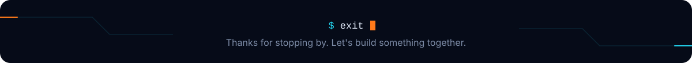

  

 

## About me

I'm a programming student at Escola Profissional de Gaia who spends most of the time building full products end to end: APIs in Django REST Framework, interfaces in React and TypeScript, and lately a lot of apps with AI at the core. I also like to mix software with hardware, from ESP32 devices to desktop apps with Tauri.

 

## Tech stack

<table>
<tr>
<td width="140"><b>Backend</b></td>
<td></td>
</tr>
<tr>
<td><b>Frontend</b></td>
<td></td>
</tr>
<tr>
<td><b>Tools and more</b></td>
<td></td>
</tr>
</table>

 

## Featured projects

 

## GitHub activity

  

 

